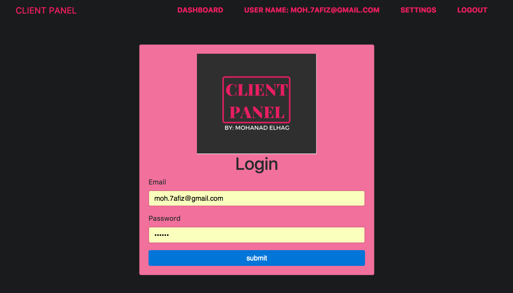

<h1 align="center">
  Client Panel Application
</h1>

<h1 align="center">
    
</h1>

## Basic Overview

Client management system that integrated with firebase.

 

## Code scaffolding

- [Angular 4]().
- [Firebase]().
- [Flash Messages - Angular 2 Module]().
- [Bootstrap 4 Alpha]().
- [JQuery]().
- [HTML5]()
- [CSS3]()
- [SASS]()

## Build

Run `ng build` to build the project. The build artifacts will be stored in the `dist/` directory. Use the `-prod` flag for a production build.

## Running unit tests

Run `ng test` to execute the unit tests via [Karma](https://karma-runner.github.io).

## Running end-to-end tests

Run `ng e2e` to execute the end-to-end tests via [Protractor](http://www.protractortest.org/).
Before running the tests make sure you are serving the app via `ng serve`.

## Further help

To get more help on the Angular CLI use `ng help` or go check out the [Angular CLI README](https://github.com/angular/angular-cli/blob/master/README.md).
